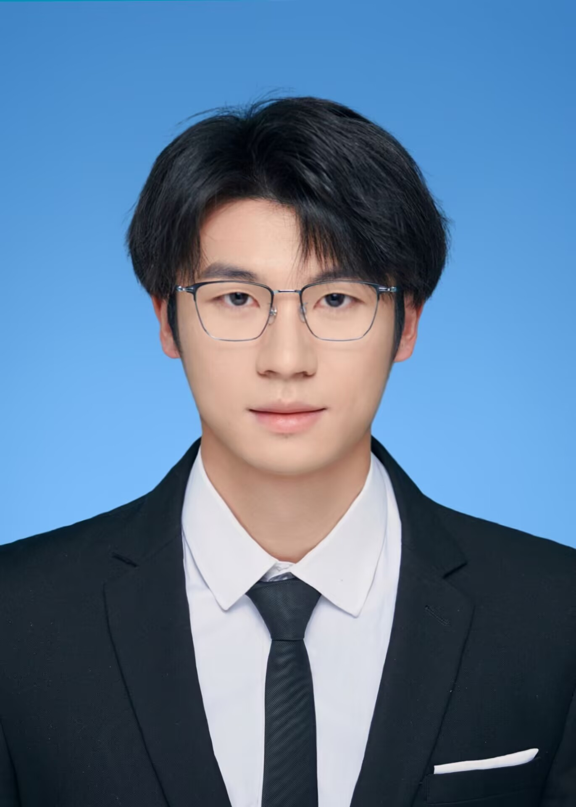

::: {.hero .fade-in}
::: {.hero__intro}
# 陈宇城 {.hero__name}

::: {.hero__tagline}
华中科技大学机器人方向本科，保送上海交通大学控制科学与工程硕士。研究方向：最优控制、路径规划、强化学习，聚焦敏捷自主飞行。
:::

::: {.skill-badges}
[最优控制]{.tag} [路径规划]{.tag} [强化学习]{.tag} [RAL · 一作在投]{.tag .tag--accent}
:::

::: {.hero__actions}
[简历](resume-zh.html){.btn .btn-primary}
[项目](project-zh.html){.btn .btn-ghost}
[邮箱](mailto:Yucheng__Chen@163.com){.btn .btn-ghost}
[知乎](https://www.zhihu.com/people/chen-yu-cheng-67-47){.btn .btn-ghost}
:::
:::

::: {.hero__photo}
{fig-alt="陈宇城"}
:::
:::

## 代表工作

::: {.project-grid}
::: {.card .fade-in .delay-1}
### 分布式多机器人遍历规划

第一作者，RAL 在投。面向未知动态环境的分布式多机器人遍历探索统一框架 —— 贝叶斯信念融合、概率连通性与 iLQR 求解器。

[查看详情 →](project-zh.html){.btn .btn-ghost}
:::

::: {.card .fade-in .delay-2}
### 基于强化学习的自适应 MPC 控制器

项目负责人。将可微分 MPC 控制器嵌入 PPO 训练回路，用强化学习在线调整 MPC 代价函数，提升定位受扰下的无人机飞行鲁棒性。

[查看详情 →](project-zh.html){.btn .btn-ghost}
:::
:::
