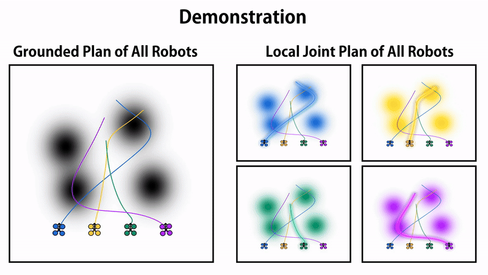
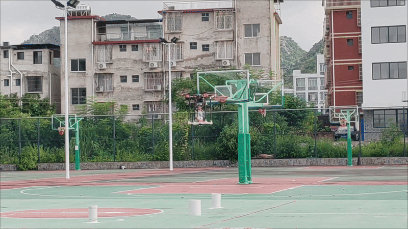

::: {.card .fade-in .delay-1}
## 基于强化学习(PPO)的自适应MPC控制器

::: {.project-card__meta}
[项目负责人]{.tag} [2025.12 – 2026.03]{.tag}
:::

::: {.project-card__media}
{fig-alt="VFH 避障演示" loading="lazy"}
:::

**项目描述：** 结合强化学习与模型预测控制技术，提升无人机在复杂环境下的飞行鲁棒性，尤其针对定位信息受干扰的场景。

**本人负责任务：**

1. **算法融合**：将 Actor-Critic 强化学习算法与 MPC 控制器相结合，利用强化学习自适应调整 MPC 的代价函数，增强系统对环境变化的适应能力。
2. **模型训练**：采用 PPO 算法并使用 MLP 网络结构构建 Actor-Critic 模型，进行强化学习训练。
3. **可微分 MPC**：采用可微分 MPC 框架，将 MPC 的优化过程纳入强化学习的训练流程中。
4. **C++ 与 Python 融合**：使用 C++ 实现可微分 MPC 控制器并加入强化学习训练 (Python)，提高训练与模型推理效率。

::: {.skill-badges}
[Python]{.tag} [C++]{.tag} [PyTorch]{.tag} [可微分 MPC]{.tag} [PPO]{.tag}
:::
:::

::: {.card .fade-in .delay-2}
## 未知动态环境下的分布式多机器人遍历规划探索

::: {.project-card__meta}
[第一作者 · RAL 在投]{.tag .tag--accent} [2025.09 – 2026.02]{.tag}
:::

::: {.project-card__media}
{fig-alt="分布式多机器人遍历规划仿真" loading="lazy"}
:::

**项目描述：** 在未知的动态环境中，通过两两局部通信实现分布式多机器人的遍历搜索规划。

**本人负责任务：**

1. **遍历搜索**：部署基于频域分析的遍历搜索算法并利用 iLQR 求解，实现机器人对信息地图的探索。
2. **滚动优化**：机器人实时更新动态信息并融合（贝叶斯滤波），基于实时与衰减的历史信息滚动优化。
3. **分布式多机器人系统**：将机器人间的连通性以概率形式引入路径规划器，优化多机器人建立连接交换各自局部信息，保障分布式机器人的通信与协同。

::: {.skill-badges}
[遍历控制]{.tag} [iLQR]{.tag} [贝叶斯滤波]{.tag} [多机器人]{.tag}
:::
:::

::: {.card .fade-in .delay-3}
## 风扰动下无人机目标搜索与物资投放

::: {.project-card__meta}
[项目负责人]{.tag} [2024.05 – 2024.10]{.tag}
:::

::: {.project-card__media}
{fig-alt="模糊 PID 控制演示" loading="lazy"}
:::

**项目描述：** 室外环境下，使无人机载重（一个 1.5L 矿泉水瓶）在 8m × 80m 的跑道上自主飞行，实现以下任务：

1. 无人机在指定起飞点自主起飞。
2. 在距起飞点 30m 远的 8 × 5m 区域内寻找白桶进行投放，白桶共三个（直径 30 / 20 / 15 cm），直径越小分值越高。
3. 在距起飞点 65m 远的 8 × 5m 区域内侦查危险物，并远程传送数据，由参赛人员在控制台填写。
4. 完成以上任务后无人机自主飞回起飞点并降落。

规定使用统一无人机平台（搭载双目鱼眼相机及二维激光雷达）。

**本人负责任务：**

1. **模糊 PID 控制器编写 (C++)**：通过模糊规则自适应调整 PID 系数，实现风扰动下无人机精准控制。
2. **路径规划算法 VFH**：依据 VFH 算法求解当前可行点，并通过 B 样条曲线优化出光滑路径。
3. **部署滤波算法**：通过卡尔曼滤波与低通滤波器滤除噪声，使控制器平滑输出。

::: {.skill-badges}
[C++]{.tag} [模糊 PID]{.tag} [VFH]{.tag} [卡尔曼滤波]{.tag}
:::
:::

::: {.card .fade-in .delay-4}
## 障碍物森林中的快递无人机

::: {.project-card__meta}
[项目负责人]{.tag} [2023.10 – 2024.05]{.tag}
:::

::: {.project-card__media}
{fig-alt="EGO-Planner 避障演示" loading="lazy"}
:::

**项目描述：** 室内环境下，使无人机载重（3 个 100g 快递盒）在 10 × 10m 的区域执行任务：

1. 在起飞点自主起飞。
2. 在 10 × 8.5m 的区域中寻找 5 个标靶进行投放，投放得分由投放准确度与标靶权重计算，同时躲避区域内的密集障碍物。
3. 执行完任务后前往 10 × 1.5m 的长廊入口，穿越长廊（含两个 80cm 宽窄道）抵达降落点准确降落。

**本人负责任务：**

1. **基于 ROS 的飞行代码 (C++)**：执行障碍森林、狭窄走廊环境下的避障与投放任务。
2. **部署 FAST-LIO 及 Ego-Planner**：无人机定位并生成可行路线，MPC 控制器跟踪路径避障。
3. **MPC 控制器 (C++)**：依据目标点与约束条件在线计算无人机加速度控制，以跟踪全局路径。

::: {.skill-badges}
[ROS]{.tag} [FAST-LIO]{.tag} [Ego-Planner]{.tag} [MPC]{.tag} [C++]{.tag}
:::
:::
